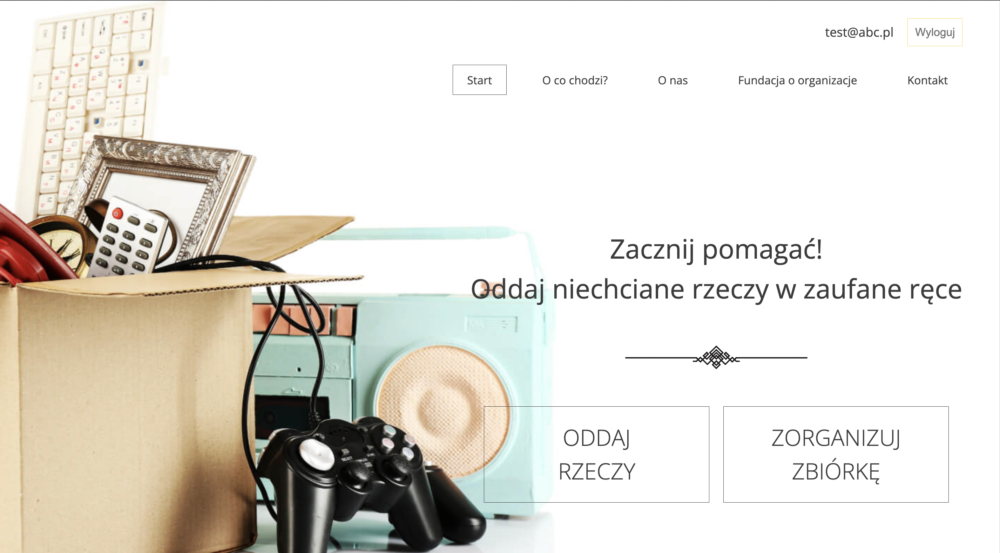

## Table of contents
* [General info](#general-info)
* [Technologies](#technologies)
* [Setup](#setup)



## General info
The main goal of the project is to collect things that people don't need anymore. You can donate to charity things like clothes, toys, and electronics. The website guides you on how you can give them away. 
	
## Technologies
Project is created with:
* React version: 18.1.0
* React Router version: 6.3.0
* React Scroll version: 1.8.7
* Sass
	
## Setup
To run this project, install it locally using npm:

```
$ cd ../lorem
$ npm install
$ npm start
```

